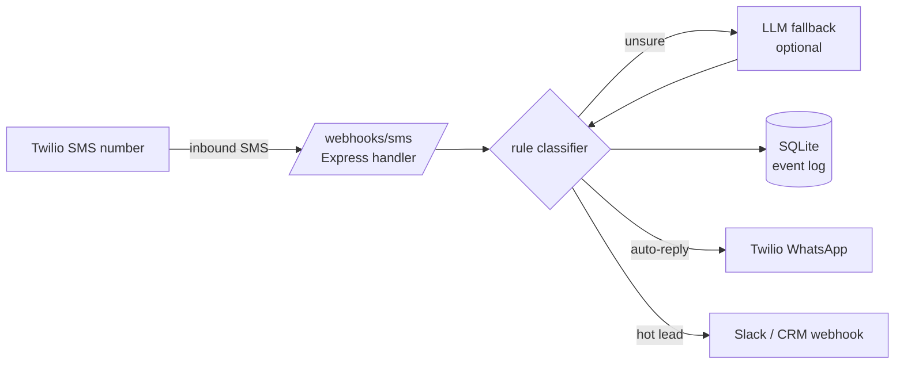

# whatsapp-twilio-lead-router

[](https://github.com/sarteta/whatsapp-twilio-lead-router/actions/workflows/tests.yml)
[](https://nodejs.org)
[](./LICENSE)

Drop-in Node.js server for **real-estate teams** that:

1. Receives inbound **SMS** on a Twilio number (typically from Zillow / Facebook lead ads / landing-page webhooks).
2. Classifies the lead intent — **buyer / seller / investor / nurture / spam** — with a cheap rule engine first, then falls back to an LLM only when the rule engine is unsure.
3. Fires an **auto-reply over WhatsApp** (via Twilio WhatsApp sender) using an intent-specific template.
4. Persists the lead + conversation in SQLite with an append-only event log.
5. Routes high-intent leads to a webhook (`LEAD_NOTIFY_WEBHOOK`) — Slack, CRM, whatever — with full context.

Built for small/mid brokerages that want "react in 60 seconds or lose the lead" and don't want a full CRM subscription for it.

> Demo data is synthetic (`Acme Realty`, `+15551234567`). Wire in real Twilio creds in `.env` to run against a real number.

---

## Live demo (no Twilio account needed)

```bash
npm install
npm run demo
```

Actual output — 8 canned inbound messages classified and auto-replied:

```
[1] +15551234567  "Hi, looking to buy a 3-bed in Austin under $500k. Pre-approved."
    → intent=buyer  reply=YES
    ↪ Hi Casey — thanks for reaching out about a property. To get you to the right agent...

[2] +15552222222  "I want to sell my house on 123 Maple Ave. Cash offer?"
    → intent=seller  reply=YES
    ↪ Hi Dana — happy to help you explore selling. Could you share the property address...

[3] +15553333333  "Investor here, looking for off-market wholesale deals in Denver."
    → intent=investor  reply=YES
    ↪ Hi Jules — passing you to our investor-focused agent...

[4] +15554444444  "Hey thanks"
    → intent=nurture  reply=YES
    ↪ Hi Ambiguous — got it, thanks. An agent will review and reach out...

[5] +15555555555  "STOP"
    → intent=stop  reply=YES
    ↪ You've been unsubscribed. Reply START to opt back in...

[6] +15556666666  "HELP"
    → intent=help  reply=YES
    ↪ Msg&Data rates may apply. Reply STOP to unsubscribe, HELP for help...

[7] +15557777777  "https://spammy.example/win-a-prize"
    → intent=spam  reply=(none)

[8] +15558888888  "Is 456 Oak St still available? Can I schedule a tour?"
    → intent=buyer  reply=YES
```

Full demo transcript in [`examples/demo-output.txt`](./examples/demo-output.txt). No network calls are made — all Twilio clients are stubs.

## Why this exists

In real-estate, most lead conversion happens in the first few minutes
after inbound contact. Brokerages miss that window all the time because:

- Agent sees the SMS at 9:47 PM and deals with it next morning.
- Generic "thanks, we'll be in touch" autoresponders burn the lead.
- When an agent does reply, there's no intent tag, so a hot buyer and a
  tire-kicker get treated the same.

What this router does:

- Auto-replies in WhatsApp in <2s, with wording tuned to the detected intent.
- Pings Slack/CRM only for hot leads, with a pre-classified intent plus
  the full inbound text.
- Sends nurture leads into a scheduled drip (day 1 / 3 / 7), no human
  touch needed.

## Architecture



Versión en español: [README.es.md](./README.es.md)

## Features

- **Rule-first classifier.** Most inbounds match a keyword rule (`looking to buy`, `cash offer`, `investor`, `stop`, etc.) and never hit the LLM, so LLM cost stays near zero.
- **Bounded LLM fallback.** Only ambiguous inputs go to the LLM. Response is strict-parsed to one of the allowed labels; any deviation → `nurture` (safe default).
- **Twilio signature validation** on every webhook — spoofed requests are dropped.
- **Idempotency on `MessageSid`.** Twilio retries webhooks on timeouts; we dedupe so the same inbound never fires two auto-replies.
- **SQLite append-only event log.** Every inbound, classification, outbound and webhook is a row. Useful for audits and template A/B testing.
- **Quiet hours.** Outside `QUIET_HOURS_START/END` (in the owner's TZ) the auto-reply is honest — "we got your message, we'll respond at 9am" — instead of pretending to be awake.
- **STOP / HELP** handlers (required by Twilio).

## Quickstart

```bash
git clone https://github.com/sarteta/whatsapp-twilio-lead-router.git
cd whatsapp-twilio-lead-router
npm install
cp .env.example .env            # fill in Twilio creds OR leave blank for demo mode
npm test                        # run test suite
npm run dev                     # starts on localhost:3000
```

Point a Twilio number's inbound SMS webhook at:

```
https://your-host.example/webhooks/sms
```

### Demo mode (no Twilio account needed)

```bash
npm run demo
```

Spins up the server + fires 8 synthetic SMS payloads against it (buyer / seller / investor / spam / stop / etc.), prints classification + auto-reply for each. Uses the mock Twilio driver — zero network calls.

## Configuration

```ini
# .env
PORT=3000
TWILIO_ACCOUNT_SID=ACxxxxxxxxxxxxxxxxxxxxxxxxxxxxxxxx
TWILIO_AUTH_TOKEN=your-auth-token
TWILIO_WHATSAPP_FROM=whatsapp:+14155238886
TWILIO_SMS_FROM=+15551234567

# Where to ping for high-intent leads
LEAD_NOTIFY_WEBHOOK=https://hooks.slack.com/services/...

# Optional: LLM fallback (skip to rule-only if missing)
LLM_PROVIDER=                    # anthropic | openai | (empty = disabled)
LLM_API_KEY=
LLM_MODEL=claude-3-5-haiku-latest

# Quiet hours (owner timezone, 24h)
OWNER_TIMEZONE=America/New_York
QUIET_HOURS_START=21
QUIET_HOURS_END=9

# Data
DATABASE_PATH=./data/leads.sqlite
```

## Intent categories

| Intent | Trigger examples | Default reply template |
|---|---|---|
| `buyer` | "looking to buy", "house hunting", "interested in 123 Main" | Confirm + capture budget + area |
| `seller` | "selling my house", "home valuation", "cash offer" | Confirm + capture address + timeline |
| `investor` | "investor", "wholesale", "off-market", "portfolio" | Capture criteria + hand to investor agent |
| `nurture` | ambiguous / generic ("thanks", "got it") | Friendly ack + schedule follow-up |
| `stop` | STOP, UNSUBSCRIBE | Opt-out confirmation, stop drip |
| `help` | HELP | Standard help footer (Twilio policy) |
| `spam` | obvious URL-only / known spam patterns | No reply |

Templates are in `src/templates/` — plain JS functions, easy to localize or brand.

## Project status

- [x] SMS webhook + signature validation
- [x] Rule-based intent classifier (7 categories)
- [x] LLM fallback (Anthropic + OpenAI)
- [x] Twilio WhatsApp outbound
- [x] SQLite event log + lead store
- [x] Notify webhook for high-intent
- [x] Quiet hours
- [x] STOP / HELP compliance
- [x] Idempotency on MessageSid
- [ ] Drip scheduler (planned)
- [ ] Admin dashboard (planned)

## License

MIT — see [LICENSE](./LICENSE).

Built by [Santiago Arteta](https://github.com/sarteta) out of real-estate
automation work. Forks and issues welcome.
